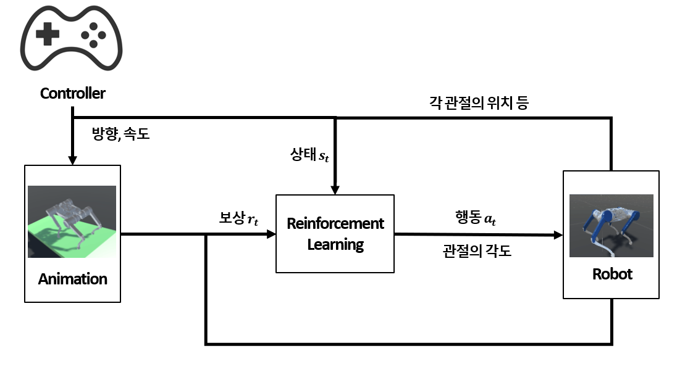
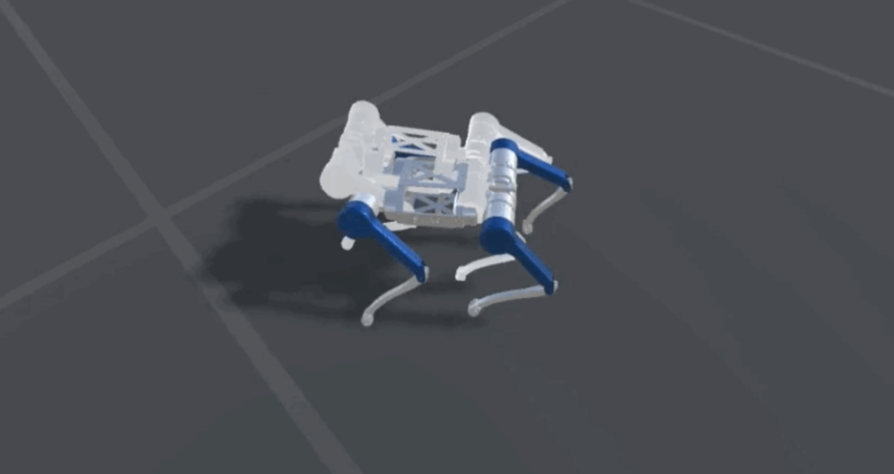

# Reinforce_learning

</img>

### Create Procedural_animation
| Slope | Stairs | Obstacle |
| :-------------------------:|:-------------------------: | :-------------------------: |
|  |  |  |

### Train
</img>

## Install Ubuntu cuda
### 1. Install nvidia driver
check recommend gpu driver
```
ubuntu-drivers devices
```
install driver
```
sudo apt install -y nvidia-driver-535
```
### 2. Install cuda
if you want to remove the existing cuda
```
sudo rm -rf /usr/local/cuda*
```
install cuda
https://developer.nvidia.com/cuda-toolkit-archive

set cuda path at /etc/profile 
(exmple cuda 11.1)
```
export PATH=$PATH:/usr/local/cuda-11.1/bin
export LD_LIBRARY_PATH=$LD_LIBRARY_PATH:/usr/local/cuda-11.1/lib64
export CUDADIR=/usr/local/cuda-11.1
```
source
```
source /etc/profile
```

check cuda
```
nvcc -V
```

### 3. Install cuDNN
download cuDNN
https://developer.nvidia.com/cudnn

extract taz file
```
tar xvzf cudnn-11.2-linux-x64-v8.1.1.33.tgz
```
copy files and chmod
```
sudo cp cuda/include/cudnn* /usr/local/cuda-11.1/include
sudo cp cuda/lib64/libcudnn* /usr/local/cuda-11.1/lib64
sudo chmod a+r /usr/local/cuda-11.1/include/cudnn.h /usr/local/cuda-11.1/lib64/libcudnn*
```
set link
```
sudo ln -sf /usr/local/cuda-11.1/targets/x86_64-linux/lib/libcudnn_adv_train.so.8.1.1 /usr/local/cuda-11.1/targets/x86_64-linux/lib/libcudnn_adv_train.so.8
sudo ln -sf /usr/local/cuda-11.1/targets/x86_64-linux/lib/libcudnn_ops_infer.so.8.1.1  /usr/local/cuda-11.1/targets/x86_64-linux/lib/libcudnn_ops_infer.so.8
sudo ln -sf /usr/local/cuda-11.1/targets/x86_64-linux/lib/libcudnn_cnn_train.so.8.1.1  /usr/local/cuda-11.1/targets/x86_64-linux/lib/libcudnn_cnn_train.so.8
sudo ln -sf /usr/local/cuda-11.1/targets/x86_64-linux/lib/libcudnn_adv_infer.so.8.1.1  /usr/local/cuda-11.1/targets/x86_64-linux/lib/libcudnn_adv_infer.so.8
sudo ln -sf /usr/local/cuda-11.1/targets/x86_64-linux/lib/libcudnn_ops_train.so.8.1.1  /usr/local/cuda-11.1/targets/x86_64-linux/lib/libcudnn_ops_train.so.8
sudo ln -sf /usr/local/cuda-11.1/targets/x86_64-linux/lib/libcudnn_cnn_infer.so.8.1.1 /usr/local/cuda-11.1/targets/x86_64-linux/lib/libcudnn_cnn_infer.so.8
sudo ln -sf /usr/local/cuda-11.1/targets/x86_64-linux/lib/libcudnn.so.8.1.1  /usr/local/cuda-11.1/targets/x86_64-linux/lib/libcudnn.so.8

ldconfig
```

check cuda
```
ldconfig -N -v $(sed 's/:/ /' <<< $LD_LIBRARY_PATH) 2>/dev/null | grep libcudnn
```

### 3. Install PyTorch
install PyTorch that fits your cuda
https://pytorch.org/get-started/previous-versions/
```
pip install torch==1.8.1+cu111 torchvision==0.9.1+cu111 torchaudio==0.8.1 -f https://download.pytorch.org/whl/torch_stable.html
```

### 4. Install ML-Agents
https://github.com/Unity-Technologies/ml-agents/tree/release_19
install ml-agents project
```
git clone https://github.com/Unity-Technologies/ml-agents.git
```

install python package
```
pip install mlagents==0.28.0
```

install protobuf, numpy, six
```
pip install --upgrade "protobuf<=3.20.1"
pip install numpy==1.20
pip install six
```

learning model
```
mlagents-learn config/ppo/3DBall.yaml --run-id=first3DBallRun
```
